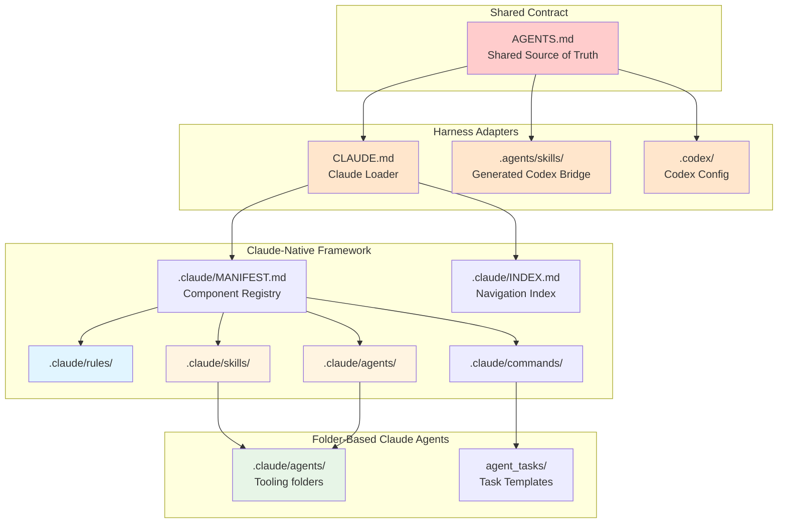
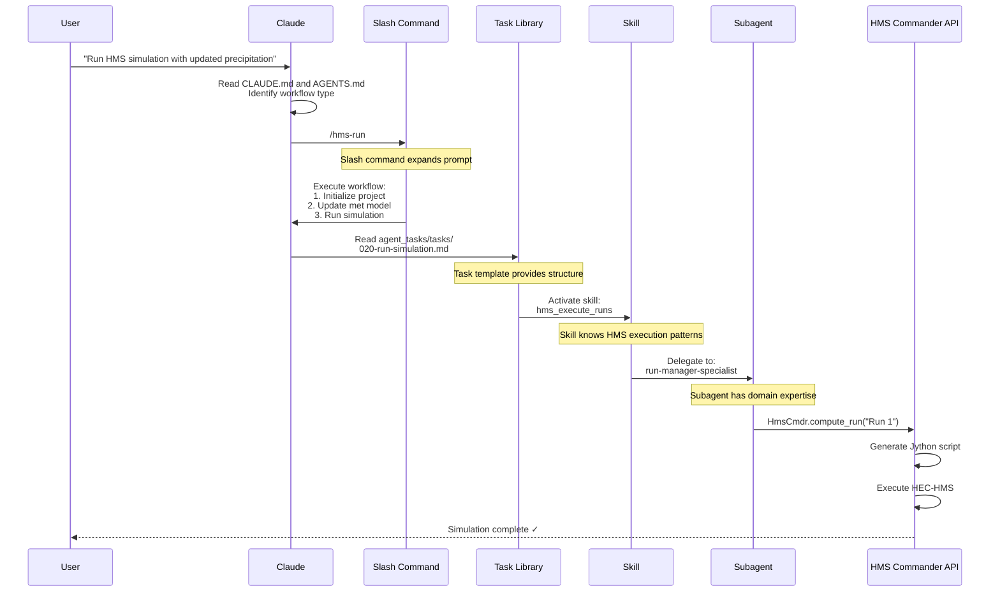
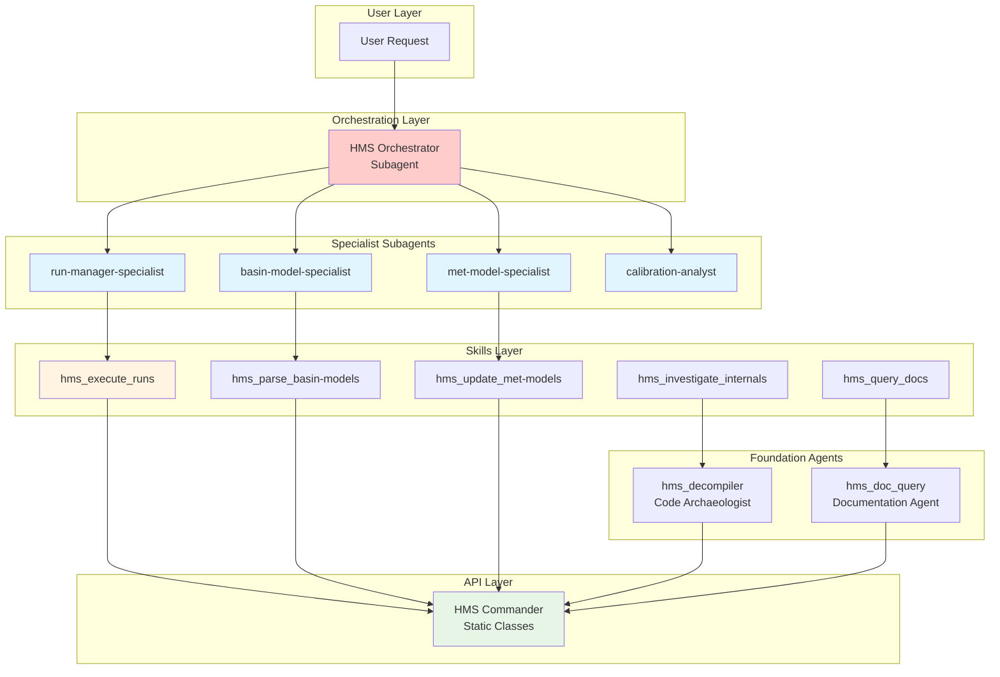
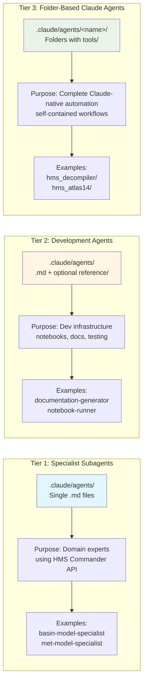
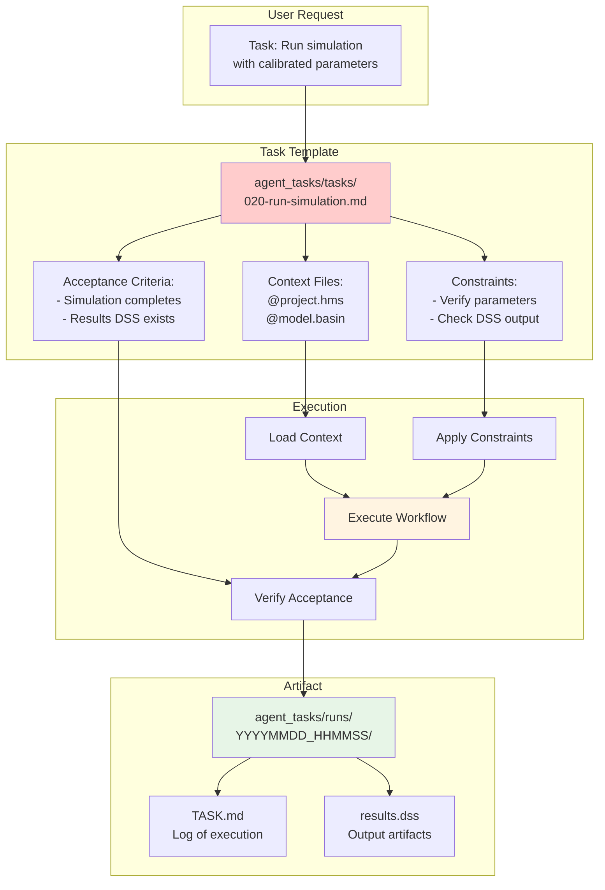

# Cognitive Architecture

**Purpose**: Explain HMS Commander's hierarchical knowledge organization, progressive disclosure, and agent orchestration patterns.

---

## Overview

HMS Commander uses a sophisticated cognitive architecture that organizes knowledge hierarchically and enables progressive disclosure of context. This approach allows AI assistants to efficiently navigate from high-level concepts to detailed implementation patterns.

---

## Hierarchical Knowledge Structure



---

## Progressive Disclosure Pattern

Claude uses **@imports** to enter the shared contract and progressively disclose Claude-native context:

```mermaid
flowchart LR
    A[User asks:<br/>'How do clone workflows work?'] --> B{Claude reads<br/>CLAUDE.md}

    B --> C[@import AGENTS.md]
    C --> D[Use .claude/MANIFEST.md<br/>for Claude-native discovery]
    D --> E[Read .claude/rules/hec-hms/clone-workflows.md]

    E --> F[Detailed Pattern:<br/>- Non-destructive clones<br/>- GUI verification<br/>- QAQC workflows]

    F --> G[Related Context:<br/>execution.md<br/>basin-files.md]

    G --> H[Claude has full context<br/>to answer question]

    style A fill:#e1f5ff
    style C fill:#ffcccc
    style E fill:#fff4e1
    style H fill:#e7f5e7
```

**Key Principle**: Context is loaded **on-demand** based on user's question, not all at once.

---

## Cognitive Flow: Request to Execution



**Layers Explained**:
1. **Slash Command**: User-friendly entry point
2. **Task Library**: Reusable workflow templates
3. **Skill**: Task-specific knowledge
4. **Subagent**: Domain specialist
5. **Code**: Static class API execution

---

## Agent Orchestration Architecture



**Routing Logic**:
- **Orchestrator** classifies request → routes to specialist
- **Specialist** uses domain knowledge → activates skill
- **Skill** executes workflow → calls API
- **API** performs operation → returns result

---

## Three-Tier Agent Architecture



**Why Three Tiers?**:
- **Tier 1**: Lightweight, framework-integrated
- **Tier 2**: Development tools, not for end users
- **Tier 3**: Shareable, production-ready, standalone

---

## Task Template System (Cognitive Backbone)



**Task Template Benefits**:
- **Repeatability**: Same structure every time
- **Context**: Automatic file loading
- **Safety**: Constraints prevent errors
- **Verification**: Acceptance criteria validate success
- **Audit Trail**: Runs folder preserves history

---

## Progressive Disclosure Example

### Level 1: Shared Contract (`AGENTS.md`)
```
User: "How do I execute HMS simulations?"

Agent reads: AGENTS.md
├── Shared harness contract
├── HMS working rules
└── Navigation to scoped AGENTS.md files
```

### Level 2: Claude Loader (`CLAUDE.md`)
```
Claude loads: CLAUDE.md
├── @AGENTS.md
├── Claude adapter notes
└── Pointer to .claude/MANIFEST.md
```

### Level 3: Claude-Native Pattern Details
```
Claude reads: .claude/rules/hec-hms/execution.md
├── HmsCmdr patterns
├── HmsJython script generation
├── Version detection (HMS 3.x vs 4.x)
├── Parallel execution patterns
└── Related patterns: @import basin-files.md
```

### Level 4: Code Execution
```
Claude has full context:
- Knows HmsCmdr.compute_run() is the method
- Knows to use init_hms_project() first
- Knows version detection is automatic
- Executes code with confidence
```

---

## Knowledge Organization Principles

### 1. **Single Source of Truth**
- Shared rules live in `AGENTS.md`
- Claude-specific files reference shared rules instead of copying them
- Generated Codex bridge entries are links, not duplicate skill source

### 2. **Hierarchical Loading**
- Start general → progress to specific
- Load only what's needed for task
- Efficient context usage

### 3. **Cross-Referencing**
- Related patterns link bidirectionally
- Skills reference rules
- Subagents reference skills
- Complete knowledge graph

### 4. **Self-Documenting**
- Structure mirrors architecture
- File locations indicate purpose
- Naming conventions convey meaning

---

## Cognitive Layers Summary

| Layer | Location | Purpose | Loaded When |
|-------|----------|---------|-------------|
| **Shared Contract** | `AGENTS.md` | Cross-harness source of truth | Always |
| **Claude Loader** | `CLAUDE.md` | Imports `AGENTS.md` and adds Claude notes | Claude sessions |
| **Codex Bridge** | `.agents/skills/` | Generated skill links | Codex skill discovery |
| **Patterns** | `.claude/rules/*/` | Claude preload helpers and detailed notes | When specific pattern needed |
| **Workflows** | `.claude/skills/` | Skill source corpus | When performing task |
| **Specialists** | `.claude/agents/` | Claude-native domain expertise | When domain knowledge needed |
| **Commands** | `.claude/commands/` | Claude slash-command entry points | When user uses /command |
| **Templates** | `agent_tasks/tasks/` | Reusable workflows | When executing structured task |
| **Folder-Based Claude Agents** | `.claude/agents/<name>/` | Complete Claude-native automation folders | When a Claude workflow needs that agent |

---

## Benefits of This Architecture

### For AI Assistants
- ✅ **Progressive disclosure** reduces context overload
- ✅ **Hierarchical structure** enables efficient navigation
- ✅ **Cross-references** build complete mental models
- ✅ **Templates** provide proven patterns

### For Developers
- ✅ **Organized knowledge** easy to update
- ✅ **No duplication** reduces maintenance
- ✅ **Clear structure** aids onboarding
- ✅ **Patterns documented** enable consistency

### For Users
- ✅ **Slash commands** provide simple entry points
- ✅ **Task templates** ensure repeatability
- ✅ **Skills** encapsulate workflows
- ✅ **Documentation** generated from structure

---

## Related Documentation

- [Architecture](architecture.md) - Technical architecture and design decisions
- [Agent Instructions Guide](claude_md.md) - Shared AGENTS/CLAUDE loading model
- [Contributing](contributing.md) - How to contribute to the project
- [Style Guide](style_guide.md) - Coding standards and patterns

---

## Next Steps

**For Claude**: Follow the shared loading pattern:
1. Read `CLAUDE.md`
2. Follow `@AGENTS.md`
3. Use `.claude/MANIFEST.md` for Claude-native discovery
4. Load specific rules, skills, and subagents as needed

**For Developers**: Maintain the architecture:
1. Put shared rules in `AGENTS.md`
2. Keep `CLAUDE.md` as a loader
3. Create skills for common workflows
4. Update `.claude/MANIFEST.md` and `.claude/INDEX.md` when adding Claude components
